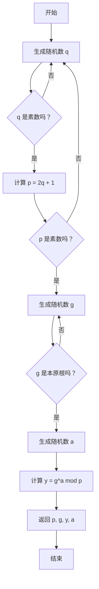

```mermaid
flowchart TD
    A[开始] --> B["生成随机数 q"]
    B --> C{"q 是素数吗？"}
    C -->|否| B
    C -->|是| D["计算 p = 2q + 1"]
    D --> E{"p 是素数吗？"}
    E -->|否| B
    E -->|是| F["生成随机数 g"]
    F --> H{"g 是本原根吗？"}
    H -->|否| F
    H -->|是| M["生成随机数 a"]
    M --> I["计算 y = g^a mod p"]
    I --> J["返回 p, g, y, a"]
    J --> K["结束"]
```